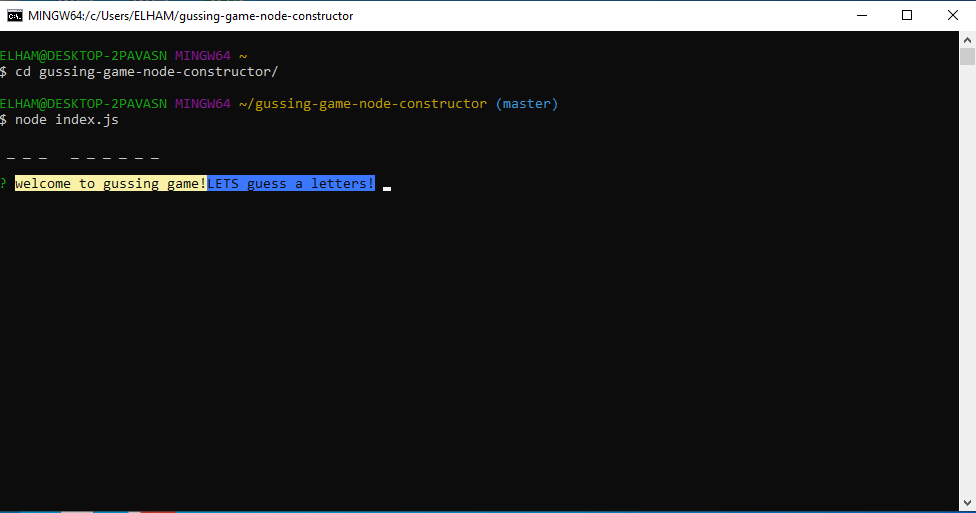
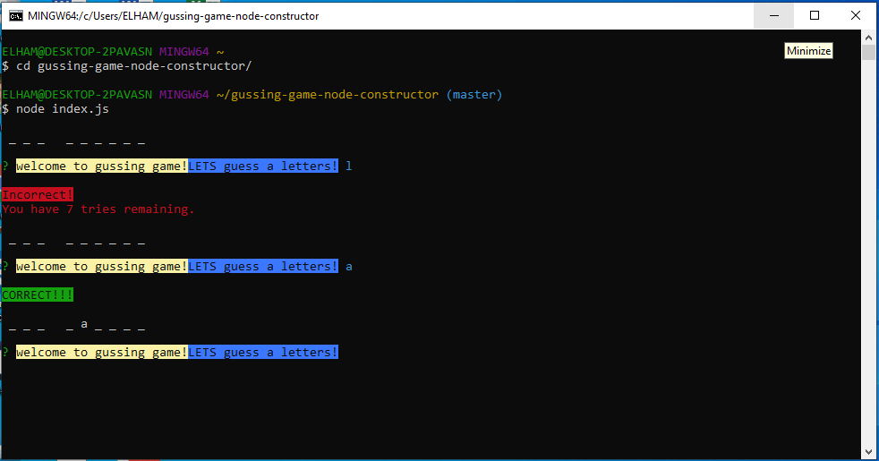
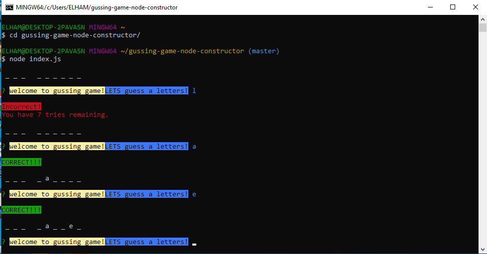
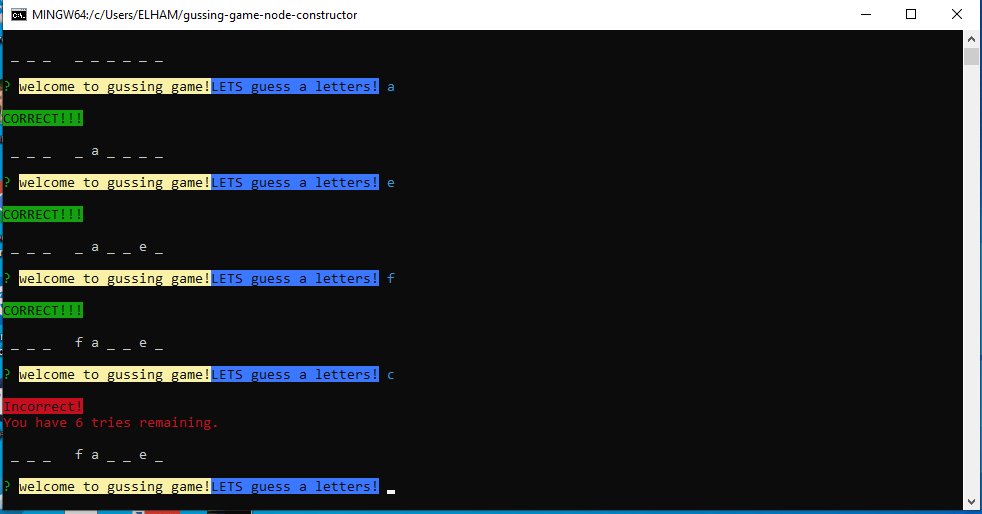
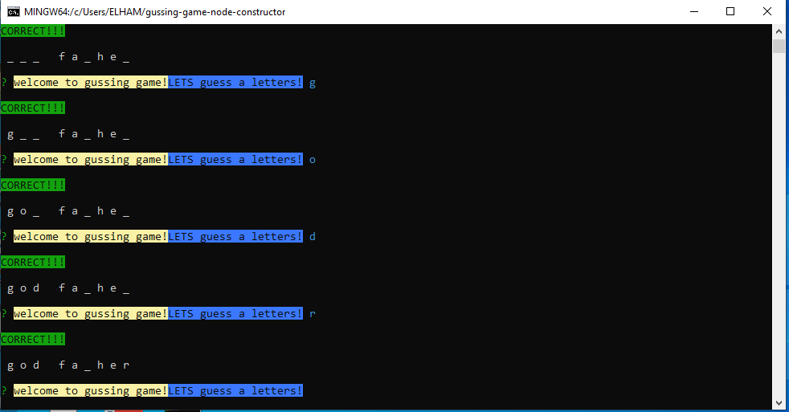
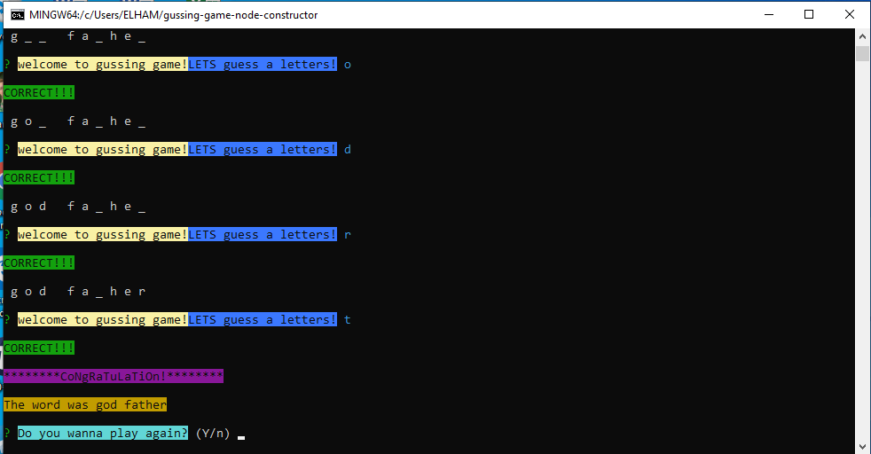
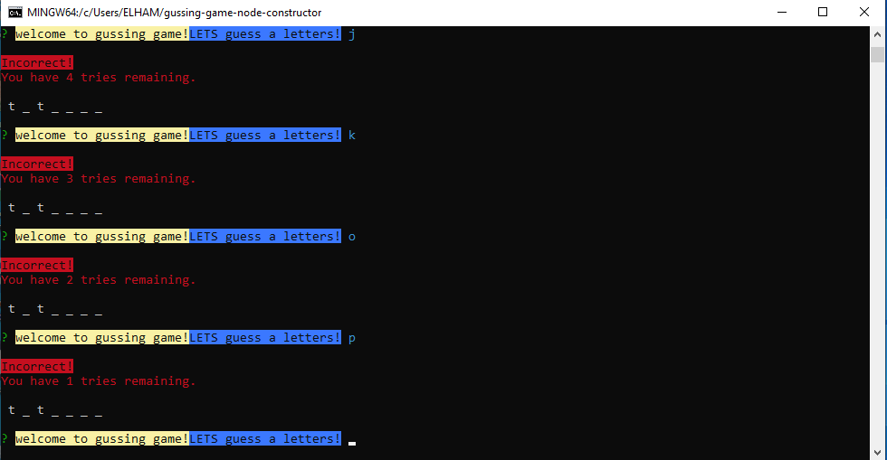
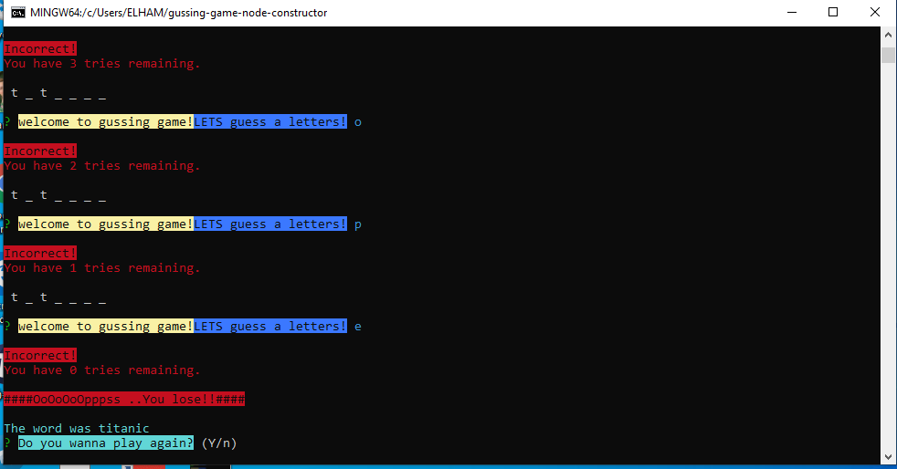

# guessing-game-node-constructor

 This is an cli game called guessing game the app pick one random word and show it like underscore and the user supposed to guess the word and the user has 8 chance to guess the letters of the word if the user can not guess she or he will be game over and app will ask you you wanna play again or not.

 ## Tech Stack

•	What languages is it written with?  node.js and i used constructors.        
•	the package i used : npm , inquirer, chalk

 ##  Previews of App 
  start the game:    
  first guess:  
  second:  
  third:  
  fourth:  
  fifth:  
  sixth:  
  incorrect guess:  
  final:  
        
